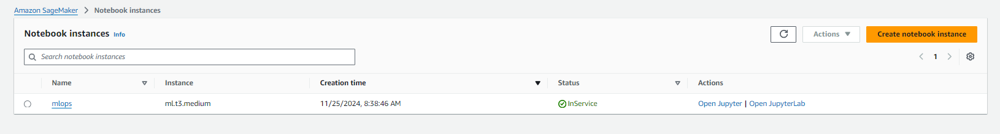

# Operationalising Image Classification Pipeline With AWS

Project to operationalise an image classification pipeline, that classfies images of Dogs. The project consists of 5 component parts: 
1. Training and deploying an endpoint.
2. Training using an EC2 instance.
3. Setting up a Lambda function.
4. Debugging the Lambda and considering security measures on the function.
5. Configuring concurrency and auto-scaling.

## Training and Deploying an Endpoint
The notebook was deployed as a SageMaker notebook instance instead of a SageMaker studio instance to reduce costs. Instance type was chosen to be 'ml.t3.medium' as it provides sufficient computing power and keeps costs low. 

The data was then uploaded to a SageMaker bucket. 

The endpoint was deployed using the training job with 3 instances.

## Training Using an EC2 Instance
EC2 instance was chosen as 'm5.xlarge' to provide the necessary computing power. Training was quick, so not many charges were incurred. 

Training completed without issues. 

The code used in ec2train1.py is the same structurally as the hpo.py code used in the SageMaker training instance. The differences come in the fact that the hpo.py parses arguments from the command line, whilst the ec2train1.py has function arguments coded in explicitly. Also, as there is no need to parse arguments in the ec2train1.py code, there is no main function. 

## Setting up a Lambda Function
The code included in ... sets up a boto3 runtime client and invokes the endpoint set up earlier. The response is then decoded and passed to the return body of the function. 

## Debugging the Lambda Function
The security issue on the Lambda function was solved by adding the permission for full SageMaker access to the IAM role. 

Doing so allows for successful testing of the function. 

The output of which is: 
"{
  "statusCode": 200,
  "headers": {
    "Content-Type": "text/plain",
    "Access-Control-Allow-Origin": "*"
  },
  "type-result": "<class 'str'>",
  "COntent-Type-In": "LambdaContext([aws_request_id=0259e9e4-6b40-42c6-8b3e-bf4954e34cde,log_group_name=/aws/lambda/mlops_lambda,log_stream_name=2024/11/26/[$LATEST]7ecd8d874f1e465388b1df52825f01b2,function_name=mlops_lambda,memory_limit_in_mb=128,function_version=$LATEST,invoked_function_arn=arn:aws:lambda:us-east-1:615287183465:function:mlops_lambda,client_context=None,identity=CognitoIdentity([cognito_identity_id=None,cognito_identity_pool_id=None])])",
  "body": "[[1.1815332174301147, -1.7327395677566528, -5.281810760498047, 1.0210962295532227, -1.4943357706069946, -2.2117197513580322, 0.6407811641693115, 0.18493691086769104, -2.9395065307617188, 0.1369694173336029, 0.9322492480278015, -1.9001216888427734, -3.4408984184265137, 0.9714353084564209, 1.6717376708984375, -0.03526506572961807, -5.223633289337158, -0.41627880930900574, -3.44187331199646, 3.098412275314331, 0.07449564337730408, 2.67580509185791, -2.5135586261749268, -2.195812463760376, -1.878147006034851, -5.6080002784729, 0.11476260423660278, -2.267141819000244, -1.6844079494476318, 0.4494684934616089, -0.46035921573638916, -2.3182947635650635, -3.8457846641540527, 1.2234355211257935, -3.4191389083862305, -5.001845836639404, -1.0585496425628662, 0.3838241994380951, -1.9769296646118164, -1.040809154510498, -2.831336498260498, 0.5109847784042358, 1.046251654624939, -0.638586163520813, 1.406373381614685, -2.160832643508911, 0.37608468532562256, 0.09922405332326889, -2.950251340866089, -1.055105447769165, -0.4222963750362396, -3.074509620666504, -3.9354047775268555, 0.6439659595489502, -4.372767448425293, 0.908115804195404, -0.617864727973938, -6.609792232513428, 0.36781829595565796, 0.31497472524642944, -4.2257981300354, -4.283807277679443, -3.728248357772827, -2.6674675941467285, -2.5589005947113037, -2.706045150756836, -0.6279201507568359, -1.4054337739944458, -1.4526814222335815, 0.8760284185409546, 1.6381537914276123, -3.1261091232299805, -1.6960111856460571, -4.109086036682129, -4.791811466217041, -1.5850549936294556, -3.593642473220825, -3.0610759258270264, -4.961845874786377, -4.166821479797363, -0.3503437340259552, -4.918450355529785, -0.9374471306800842, 0.019495835527777672, -1.436165452003479, -2.703030824661255, -4.186699867248535, -2.48059344291687, -2.3448665142059326, -1.5691924095153809, -2.1192800998687744, -1.1762725114822388, -5.178257942199707, -8.140262603759766, -4.440650463104248, -2.322875499725342, -2.856032609939575, 1.4859707355499268, -2.0015289783477783, -4.740804672241211, -5.445560455322266, -0.9530583620071411, -3.0175766944885254, -4.221081733703613, -3.5264806747436523, -2.1017611026763916, -2.23700213432312, 0.14833097159862518, 0.7740587592124939, 2.024197816848755, -0.28635233640670776, -1.664210319519043, -4.302731513977051, -3.885741949081421, -2.686450242996216, 1.215208649635315, -1.6881959438323975, 1.2637850046157837, -4.80579948425293, -0.8513407707214355, -2.7424919605255127, -3.1231958866119385, -1.3606722354888916, -3.8829307556152344, -6.171679496765137, -3.985597848892212, -4.25550651550293, 1.8628137111663818, -3.9561784267425537, -0.9935227036476135, -6.1183319091796875, -2.972365140914917, -2.646411657333374]]"
}"

Whilst the attached IAM policy solves the access issues, it also gives the Lambda function access to all other SageMaker services. In the future, the use of an IAM policy that gives access solely to endpoints might be a better choice. Other security considerations would be to frequently monitor the logs to check for unknown activity and to frequently update and remove unused IAM roles. 

## Concurrency and Auto-scaling
To finalise the pipeline, capabilities for concurrency was added to the Lambda function. Provisional concurrency was selected to be 5 instances, which provides reasonable capability whilst keeping costs low. Reserved concurrency was then chosen to be 3 to allow for room for expansion if required. 

Autoscaling was also added to the endpoint with the following configuration: 
"max instances: 3, 
warm up: 30s,
cool down: 30s
"

This was chosen to be fast to react to incoming traffic changes, whilst also keeping costs low.

For both concurrency and autoscaling, these were initial values and should be reviewed when more information on the traffic to the endpoint is known.  
